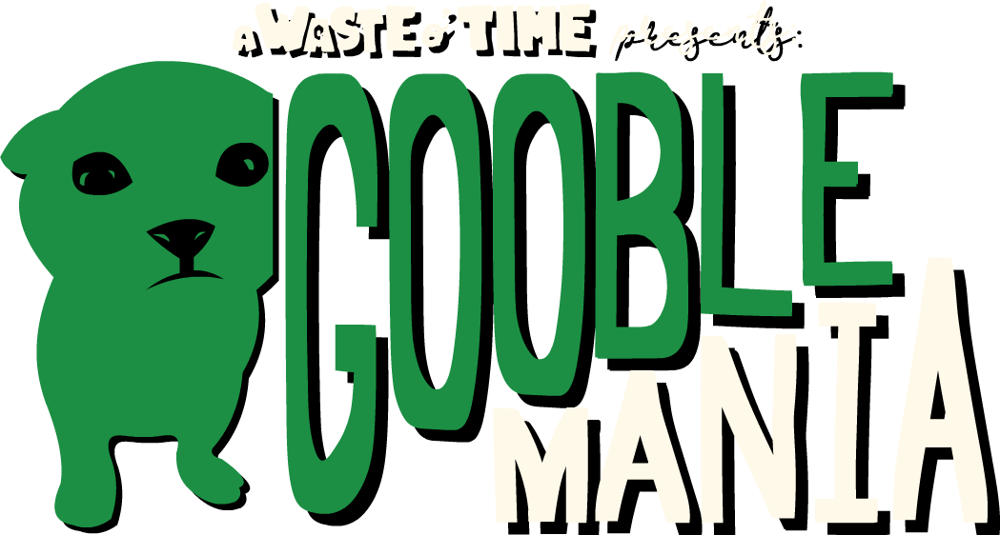

# A Waste o' Time: Gooblemania

## An offshoot of my variety platformer *A Waste o' Time*, hideous cat things have taken over Garcia Village... and of course it's your job to get rid of them all.

**Requires Godot 4.5 and above.** Simply clone the repository and run it in Godot.
Note that some desktop features have been stripped from the game so it could work on web without problems, most especially an options screen and everything involving window resolutions.

**You are only entitled to personal usage of the codebase!** I will catch you because I repeatedly LOOK MY NAME UP ON GOOGLE
